# ansible-vault password: hessor
# Task #1
## 1. set-password-policy.yml
```yaml
---
- name: Set password policy with PAM
  hosts: all
  gather_facts: true
  become: true

  tasks:
    - include_role:
        name: 'set-password-policy-Debian'
    - include_role:
        name: 'set-password-policy-RedHat''
```
## 2. Check /etc/pam.d/system-auth before running playbook.
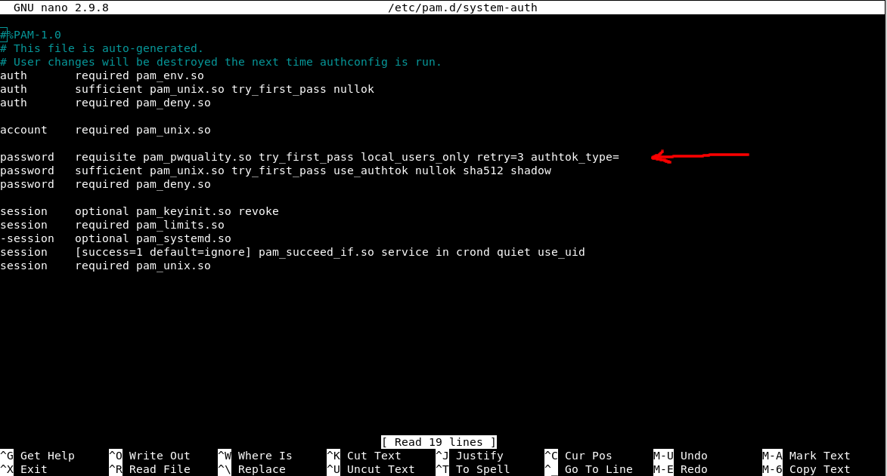
## 3. Run set-password-policy.yml.
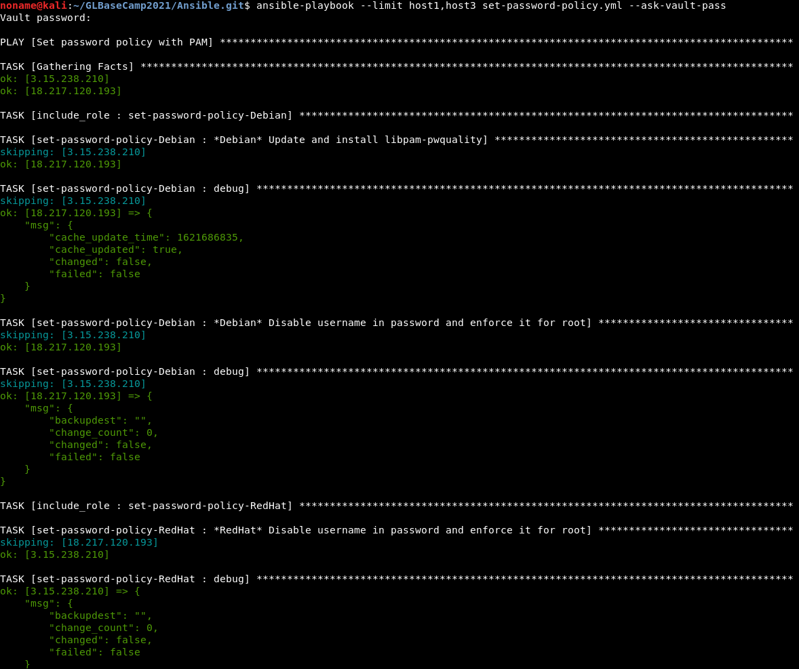
## 4. Check /etc/pam.d/system-auth.
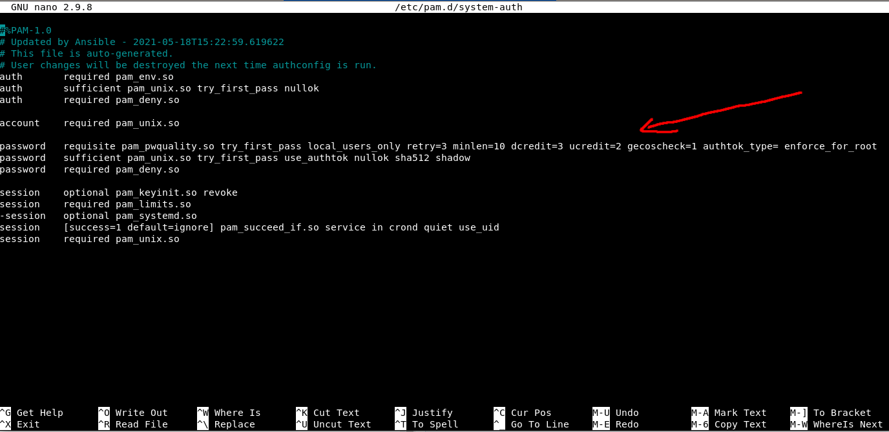
## 5. Testing:
   - logged in to VM;
   - created a user "lexa";
   - tried to set invalid password;
   - the same for root.<br>

RedHat

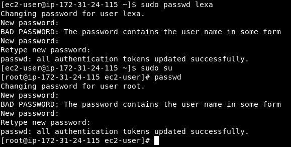

Debian

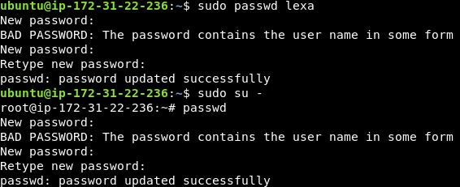
# Task #2
## 1. allow-ssh-from-ansible-host-and-localhost.yml
```yaml
---
- name: Allow SSH access only from ansible host and localhost
  hosts: all
  become: true
  gather_facts: true

  tasks:
    - include_role: 
        name: 'allow-ssh-from-ansible-host-and-localhost'
```
## 2. Check /etc/hosts.allow and /etc/hosts.deny before running playbook.
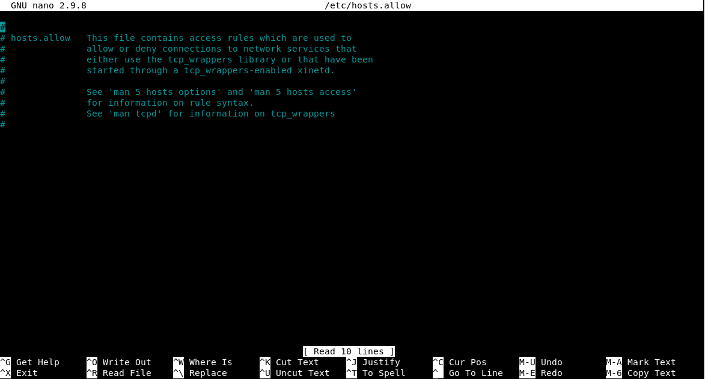
## 3. Try to log in via ssh from VM #2 to VM #1.
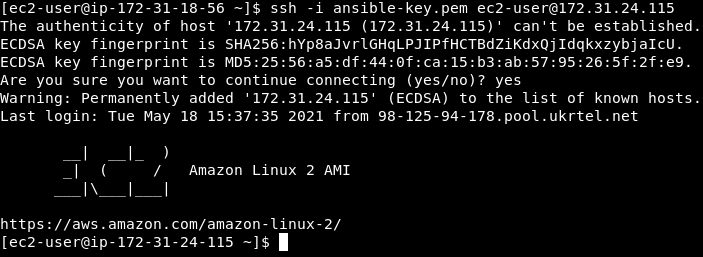
## 4. Run allow-ssh-from-ansible-host-and-localhost.yml.
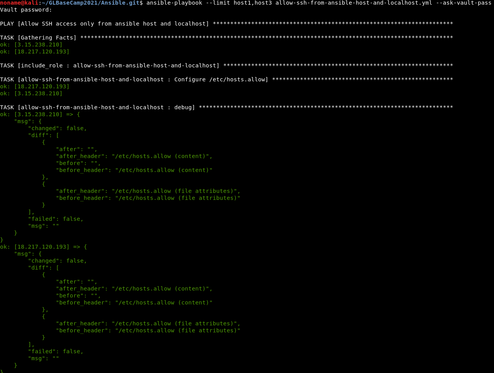
## 5. Check /etc/hosts.allow and deny.
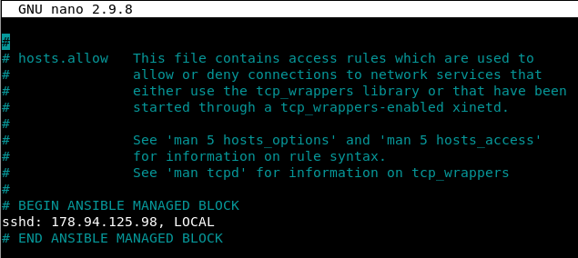
## 6. Testing:
   - logged in to VM #2 and #3;
   - tried to log in to VM #1.

From Redhat to Redhat

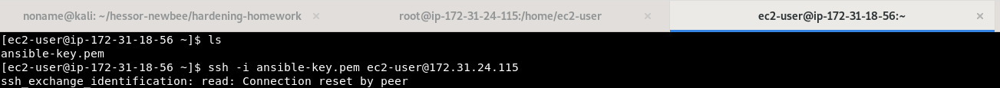

From Debian to Redhat

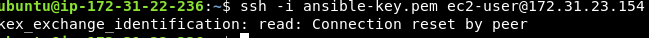

